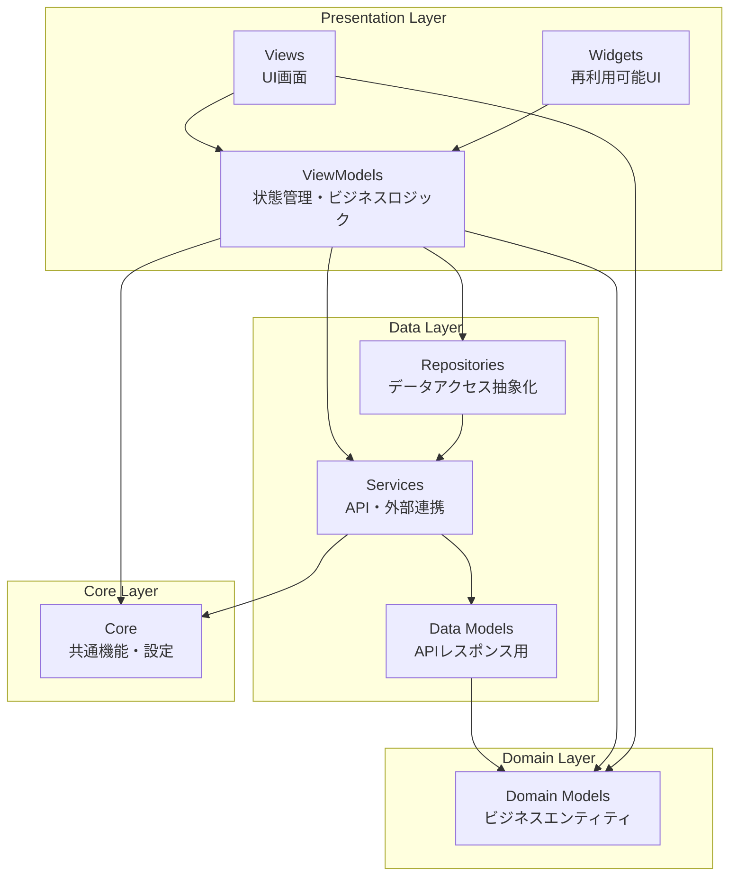

# Cat Food Reviews アプリ アーキテクチャドキュメント

## 概要

本アプリは **MVVM (Model-View-ViewModel)** パターンを採用したFlutterアプリケーションです。
**Riverpod** を使用した状態管理により、依存性注入と一方向データフローを実現しています。

## アーキテクチャ図



## ディレクトリ構成

```
lib/
├── core/                           # 共通機能・設定
│   ├── analytics/                  # 分析・トラッキング
│   │   ├── analytics_provider.dart
│   │   ├── analytics_service.dart
│   │   ├── analytics_user_property.dart
│   │   ├── analytics_validator.dart
│   │   └── firebase_analytics_provider.dart
│   ├── firebase/                   # Firebase設定
│   │   ├── firebase_initializer.dart
│   │   └── options/
│   │       ├── firebase_options_dev.dart
│   │       └── firebase_options_prod.dart
│   ├── logger/                     # ログ機能
│   │   ├── app_logger.dart
│   │   └── logger_provider.dart
│   ├── sentry/                     # エラートラッキング
│   │   └── sentry_initializer.dart
│   ├── app_colors.dart             # カラーパレット
│   └── app_theme.dart              # テーマ設定
├── data/                           # データ層
│   ├── repository/                 # データアクセス抽象化
│   │   └── cat_food/               # キャットフード機能
│   │       └── cat_food_repository.dart    # リポジトリ
│   └── service/                    # サービス層
│       └── api/                    # API通信
│           ├── api_client.dart     # HTTPクライアント設定
│           ├── cat_food_api_service.dart   # キャットフード分析API
│           └── cat_food_analysis_response.dart # APIレスポンス用モデル
├── ui/                             # UI層（MVVM）
│   └── onboarding/                 # オンボーディング画面
│       ├── onboarding_screen.dart  # View
│       ├── onboarding_view_model.dart # ViewModel
│       └── model/                  # 画面固有モデル
│           ├── feature.dart        # 機能定義モデル
│           └── cat_food_analysis.dart # 分析結果モデル
├── widgets/                        # 再利用可能Widget
│   ├── app_background.dart         # アプリ背景
│   └── feature_card.dart           # 機能カード
├── gen/                            # 自動生成ファイル
│   └── assets.gen.dart
└── main.dart                       # アプリエントリーポイント
```

## 各層の責務

### 🎨 **Presentation Layer (プレゼンテーション層)**

#### **Views**
- **責務**: UI表示、ユーザーインタラクション処理
- **依存**: ViewModel、Domain Models
- **例**: `onboarding_screen.dart`

```dart
class OnboardingScreen extends ConsumerWidget {
  @override
  Widget build(BuildContext context, WidgetRef ref) {
    final state = ref.watch(onboardingViewModelProvider);
    final viewModel = ref.read(onboardingViewModelProvider.notifier);
    
    return Scaffold(/* UI実装 */);
  }
}
```

#### **Widgets**
- **責務**: 再利用可能なUIコンポーネント
- **依存**: Domain Models（表示用）
- **例**: `feature_card.dart`, `app_background.dart`

#### **ViewModels**
- **責務**: 画面状態管理、ビジネスロジック実行
- **依存**: Services, Repositories, Domain Models
- **パターン**: Riverpod StateNotifier

```dart
@riverpod
class OnboardingViewModel extends _$OnboardingViewModel {
  Future<void> analyzeFood(String imagePath) async {
    final apiService = ref.read(catFoodApiServiceProvider);
    // ビジネスロジック実行
  }
}
```

### 📊 **Data Layer (データ層)**

#### **Repositories**
- **責務**: データアクセスの抽象化、キャッシュ戦略
- **依存**: Services
- **パターン**: Repository Pattern

```dart
class CatFoodRepository {
  Future<CatFoodAnalysis> analyzeFood(String imagePath) async {
    // API + ローカルキャッシュの組み合わせ
  }
}
```

#### **Services**
- **責務**: 外部API通信、データ変換
- **依存**: Data Models
- **例**: `cat_food_api_service.dart`

```dart
class CatFoodApiService {
  Future<CatFoodAnalysis> analyzeFood(String imagePath) async {
    // HTTP通信とレスポンス変換
  }
}
```

#### **Data Models**
- **責務**: APIレスポンスのシリアライゼーション
- **依存**: Domain Models（変換用）
- **例**: `CatFoodAnalysisResponse`

### 🏢 **Domain Layer (ドメイン層)**

#### **Domain Models**
- **責務**: ビジネスエンティティ、ビジネスルール
- **依存**: なし（Pure Dart）
- **例**: `CatFoodAnalysis`, `SafetyLevel`

```dart
class CatFoodAnalysis {
  // ビジネスロジック
  double get recommendationScore { /* 計算ロジック */ }
  String get safetyOverview { /* 安全性概要 */ }
}
```

### 🔧 **Core Layer (コア層)**

#### **共通機能**
- **Analytics**: Firebase Analytics連携
- **Logger**: アプリ全体のログ出力
- **Firebase**: Firebase初期化設定
- **Sentry**: エラートラッキング
- **Theme**: アプリテーマ・カラー設定

## 技術スタック

### **フレームワーク**
- **Flutter**: UI フレームワーク
- **Dart**: プログラミング言語

### **状態管理**
- **Riverpod**: 依存性注入 + 状態管理
- **riverpod_annotation**: コード生成による型安全性

### **HTTP通信**
- **Dio**: HTTPクライアント
- **Interceptors**: ログ出力、エラーハンドリング

### **開発支援**
- **Firebase Analytics**: ユーザー行動分析
- **Firebase Crashlytics**: クラッシュレポート
- **Sentry**: エラートラッキング

### **コード生成**
- **build_runner**: コード生成ツール
- **json_annotation**: JSONシリアライゼーション

## データフロー

### **1. 分析リクエスト時**
```
View (ボタンタップ)
  ↓
ViewModel (analyzeFood())
  ↓
Repository (キャッシュチェック)
  ↓
Service (API通信)
  ↓
Data Model (レスポンス解析)
  ↓
Domain Model (ビジネスロジック適用)
  ↓
ViewModel (状態更新)
  ↓
View (UI更新)
```

### **2. エラーハンドリング**
```
Service (API エラー)
  ↓
Repository (フォールバック処理)
  ↓
ViewModel (エラー状態設定)
  ↓
View (エラー表示)
```

## 設計原則

### **1. 単一責任の原則 (SRP)**
- 各クラスは1つの責務のみを持つ
- 変更理由も1つに限定

### **2. 依存関係逆転の原則 (DIP)**
- 上位層は下位層の抽象化に依存
- Riverpodによる依存性注入で実現

### **3. 開放閉鎖の原則 (OCP)**
- 拡張に対して開放、修正に対して閉鎖
- インターフェースを通じた拡張性確保

### **4. インターフェース分離の原則 (ISP)**
- 使用しないインターフェースへの依存を避ける
- 小さく特化したプロバイダー設計

## テストストラテジー

### **ユニットテスト**
- **Domain Models**: ビジネスロジックテスト
- **ViewModels**: 状態変更ロジックテスト
- **Services**: API通信ロジックテスト

### **ウィジェットテスト**
- **Views**: UI表示テスト
- **Widgets**: コンポーネントテスト

### **インテグレーションテスト**
- **API連携**: 実際のAPI通信テスト
- **画面遷移**: ユーザーフローテスト

## パフォーマンス考慮事項

### **状態管理**
- Riverpodの適切なプロバイダー分割
- 不要な再描画の防止

### **ネットワーク**
- レスポンスキャッシュによる高速化
- 適切なタイムアウト設定

### **画像処理**
- 画像圧縮による通信量削減
- プログレッシブローディング

## 今後の拡張予定

### **機能追加**
- オフライン対応（ローカルデータベース）
- プッシュ通知
- ユーザー認証
- SNSシェア機能

### **技術改善**
- GraphQL導入
- CI/CD パイプライン構築
- パフォーマンス監視強化

---

このアーキテクチャにより、保守性・拡張性・テスタビリティを確保し、
チーム開発での生産性向上を実現します。